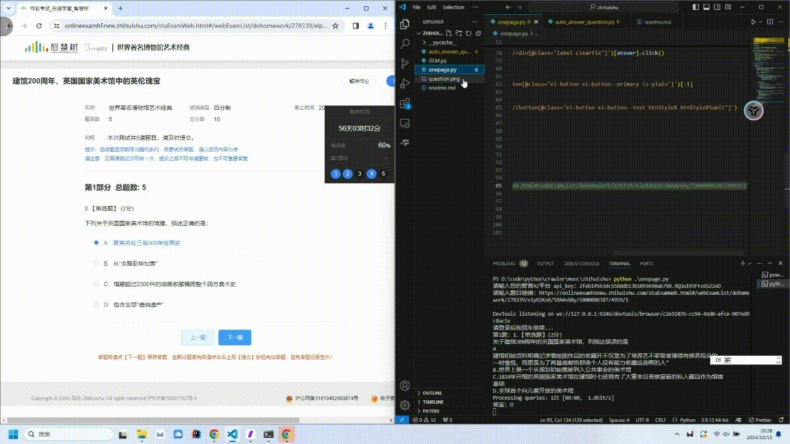
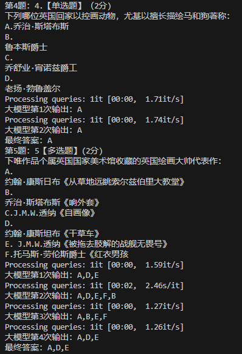
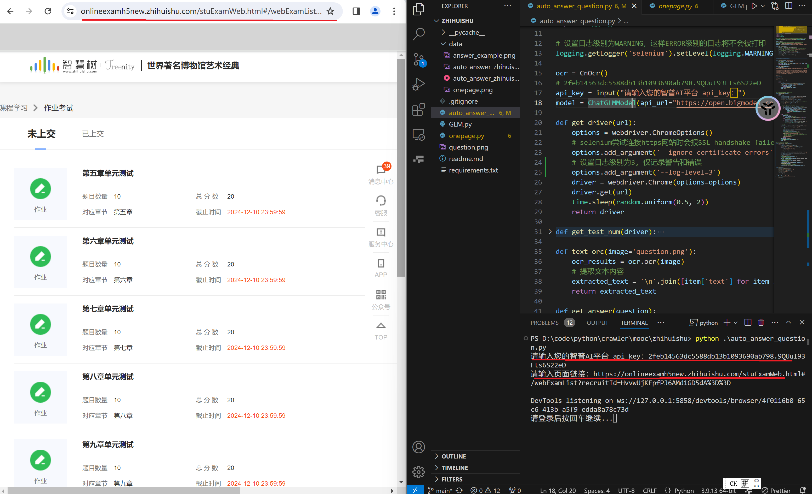

# 🌟 智慧树自动答题助手

## 📝 项目简介

这是一个基于大语言模型（Large Language Models, LLM）的智慧树自动答题脚本，旨在帮助用户快速、准确地完成智慧树平台上的自动答题任务。本项目通过全自动答题的方式，无需题库，利用 LLM 的强大能力，多次生成答案以确保答案的准确性，能够极大地解放的生产力。

## 🌈 项目展示



答题过程：



调用大模型生成答案过程：

```python
def get_answer(question):
    prompt = f"""
请仔细阅读以下题目并思考分析，根据题目类型，严格按照以下要求作答：

选择题（单选）： 如果题目为单选题，请从选项中选择一个正确的答案，并仅输出该选项（A、B、C或D），不提供任何额外解释。
选择题（多选）： 如果题目为多选题，请选择所有正确的选项，并仅输出所有正确选项的字母，用','分隔（如A,C），按字母顺序排列，不提供任何额外解释。
判断题： 如果题目为判断题，请分析题目并仅输出 "对" 或 "错"，不提供任何额外解释。
请遵循以上规则直接给出你的答案。

题目：
{question}

你的答案："""
    answer_list = []
    index = 0
    while True:
        cur_answer = model.get_response([prompt])[0][0]
        print(f'大模型第{index+1}次输出：{cur_answer}')
        if cur_answer in answer_list:
            return cur_answer
        answer_list.append(cur_answer)
        index += 1
```

让大模型多次生成答案, 将最先出现两次的答案作为最终答案, 确保答案的准确性。(即使这样也无法保证百分百的准确性, 这是现有大模型本身的局限性, 作者用三个大模型来答题正确率也是一般般。如果可以拿到题库做数据集，然后用 RAG 可能会提高正确率。)

## 🚀 功能特点

- **全自动答题**：无需人工干预，自动完成答题过程。
- **准确性保障**：通过多次生成答案，提高答案的准确性。
- **易于使用**：只要你的电脑安装了 Python 环境，注册了对应大模型 API，并安装了必要的库，就可以直接运行脚本。
- **学习价值**：对于想要学习 Python 爬虫或自动化脚本以及大模型使用的同学，这是一个极好的练手项目。

## 🐞 已知问题与优化方向

- **页面元素定位**: 题目元素被“#shadow-root (closed)”包裹，无法获取，只能使用 OCR 识别题目；提交作业后弹出的对话框无法定位，只能手动确定后再继续。
- **OCR 识别**：当前项目需要调用 OCR 库来识别题目，导致运行效率比较慢。计划使用更高效的 OCR 库，或者不用 OCR，直接用 Selenium 分析题目，以提高效率。
- **答题准确率**：由于依赖大模型，答题准确率可能会受到影响。考虑调用多个大模型交叉验证，或者构建知识库做 RAG，以提高答题准确率。
- **增加支持的大模型**: 目前项目只支持智谱大模型，计划增加其他大模型的支持。
- **流程优化**：优化使用流程。

## 🛠️ 安装与使用

### 环境要求

- 确保你的电脑安装了 Python。
- 注册并获取 API-Key, 本项目目前只支持[智谱大模型](https://open.bigmodel.cn/console/overview)

### 安装步骤

1. 克隆项目到本地：

   ```bash
   git clone https://github.com/jason-king123/ZHIHUISHU-Auto-Answer-Assistant.git
   cd ZHIHUISHU-Auto-Answer-Assistant
   ```

2. 安装依赖库：

   ```bash
   pip install -r requirements.txt
   ```

### 使用说明

**注意：在运行代码之后需要输入 api_key 和对应的页面 url，打开网页之后需要自行登录，按回车键开始答题。每答完一个测试的题目需要点击提交，输入回车键后继续**

运行脚本：

_因为要加载 OCR 库，所以需要等待一段时间代码才会运行_

**1. 输入答题页面 url，一次完成单测试答题**

```bash
python onepage.py
```


**2. 输入答题列表页面 url，顺序完成所有测试答题**

```bash
python auto_answer_question.py
```



## 🤝 贡献与反馈

- 如果在使用过程中遇到任何问题，欢迎在项目的[Issues](https://github.com/yourusername/ZHIHUISHU-Auto-Answer-Assistant/issues)页面提出, 作者看到一定会及时回复！
- 我们非常欢迎对代码的贡献，可以通过[Pull Requests](https://github.com/yourusername/ZHIHUISHU-Auto-Answer-Assistant/pulls)提交你的改进。
- 如果你觉得这个项目对你有帮助，欢迎点个 Star 支持一下！

---

🌈 希望这份 README 能够帮助你更好地展示和使用你的智慧树自动答题系统项目！如果有任何需要调整的地方，请随时告诉我。🚀🌟
